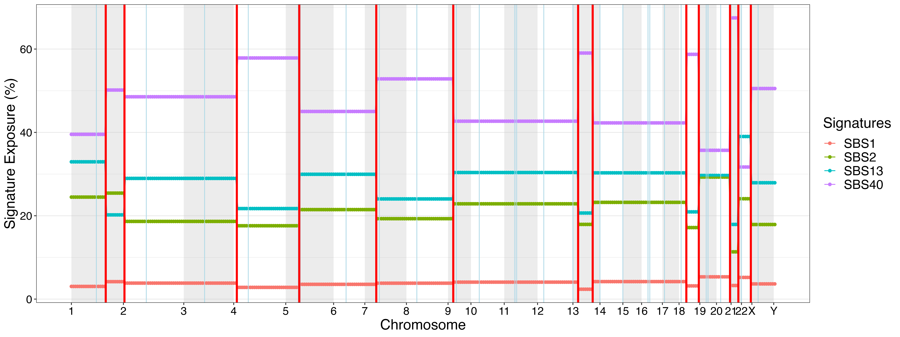
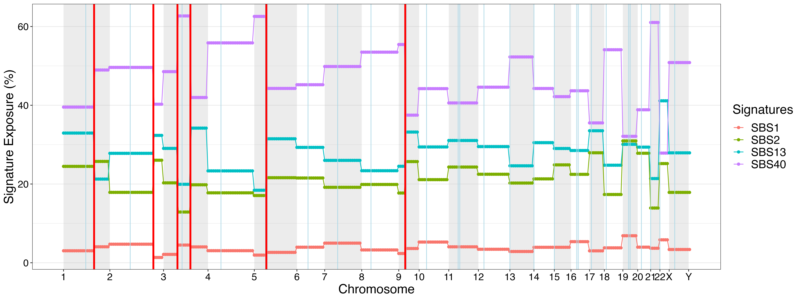
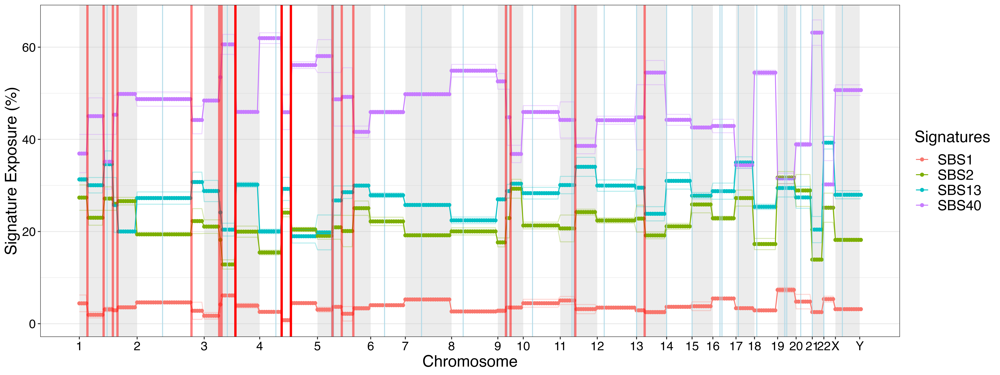
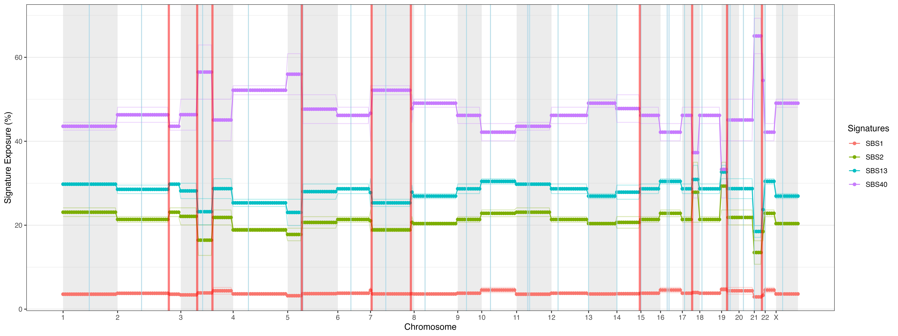

README
================

# GenomeTrackSig R package (dev)

### [Morris Lab](https://www.morrislab.ai/), Sloan Kettering Institute. R package for GenomeTrackSig.

To cite, please visit this
[link](https://journals.plos.org/ploscompbiol/article?id=10.1371/journal.pcbi.1010733).

Please create an
[Issue](https://github.com/morrislab/GenomeTrackSig/issues) or email
caitlintimmons811@gmail.com with questions.

# Dependencies

R \>= 3.3.3

This package imports the following other R packages:

- reshape2 \>= 1.4.3 (CRAN)

- ggplot2 \>= 3.2.0 (CRAN)

- NMF \>= 0.21.0 (CRAN)

- assertthat \>= 0.2.1 (CRAN)

- BSgenome.Hsapiens.UCSC.hg19 \>= 1.4.0 (Bioconductor)

- GenomicRanges \>= 1.26.4 (Bioconductor)

- Biostrings \>= 2.42.1 (Bioconductor)

- SummarizedExperiment \>= 1.4.0 (Bioconductor)

- VariantAnnotation \>= 1.20.3 (Bioconductor)

- grid \>= 3.3.3 (CRAN)

- progress \>= 1.2.2 (CRAN)

In addition, we recommend importing the following R packages which are
required for parallelization or plotting genomic and epigenomic features
alongside signature profiles.

- cowplot \>= 1.1.1 (CRAN)

- foreach \>= 1.5.1 (CRAN)

- doParallel \>= 1.0.16 (CRAN)

- TxDb.Hsapiens.UCSC.hg19.knownGene \>= 3.2.2 (Bioconducter)

- GenomicFeatures \>= 1.47.14 (Bioconducter)

# Installation

To install the package, enter the following command into the R console:

``` r
devtools::install_github("morrislab/GenomeTrackSig")
```

# Demo

**Using the example data provided in `extdata/`, the following code will
plot the signature profile, and return the fitted mixture of signatures
for each bin, the bins where changepoints were detected, and create the
ggplot object to visualize the signature profile with changepoints.**

Two example datasets are provided, both of which contain genome-wide
mutation counts for an individual sample. We recommend using
`Example_counts.csv` to test basic package functionality since it has
fewer mutations and will yield faster runtime. We recommend using
`Example_counts_large.csv` , which has more mutations, to test
functionalities described in [Section 5](#sec-additionaloptions).

1\. First, load the CSV dataset of mutation counts. In the example
datasets provided, we classify mutations into one of 96 types based on
the mutation type and trinucletotide context. We aggregate mutation
counts by megabase, since 1 Mb is generally the smallest region across
which GenomeTrackSig will demarcate with changepoints, but this step is
not required. In this dataset, rows are 1 Mb genomic regions and columns
represent region location (including starting chromosome, start
position, ending chromosome, end position, region width) and mutation
counts for each of 96 mutation types.

``` r
# load packages
library(GenomeTrackSig)
library(ggplot2)

# read in example datasets
counts = read.csv(system.file(package = "GenomeTrackSig", 
                              "extdata/Example_counts.csv"))

large_counts = read.csv(system.file(package = "GenomeTrackSig", 
                                    "extdata/Example_counts_large.csv"))
```

2\. Next, restrict the list of signatures to fit exposure for. This is
recommended for improving speed by making the model smaller. We
recommend manually specifying tissue-specific active signatures when
running GenomeTrackSig, but active signatures may also be determined
using the `detectActiveSignatures()` function. To illustrate this
function, we use the default `threshold` of 5%, meaning that signatures
with activity less than 5% across all genomic regions will not be fit.

``` r
set.seed(0811)

# restrict signatures
detectedSigs <- detectActiveSignatures(counts = large_counts, 
                                       threshold = 0.05, 
                                       binSize = 100)
```

2\. Next, we demonstrate the simplest use case by computing the
signature activity profile across all regions of the genome. The minimal
input for `GenomeTrackSig()` is a dataframe of mutation counts, a list
of active signatures to fit, and the desired number of mutations per
bin. We recommend a minimum bin size of 100 mutations. If signature
activities differ between two bins, then a changepoint will be placed at
the boundary between bins.

``` r
set.seed(0811)

# construct genome-wide signature activity profile
sigprofile <- GenomeTrackSig(counts = large_counts, 
                             activeInSample = c("SBS1", "SBS2", "SBS13", "SBS40"), 
                             binSize = 100)
```

3\. Visualize the activity profile using the `plotGenomeProfile`
function. The `chr_level` parameter specifies if segmentation was
performed on each chromosome individually or on the entire genome.

``` r
profilePlot <- plotGenomeProfile(profile = sigprofile, 
                                 chr_level = FALSE, 
                                 cutoff = 0)
```



4\. Optionally, we can then plot the signature activity profile
alongside contextual genomic information, including GC content, mutation
density, gene density, and ChromHMM chromatin states.

``` r
# plot profile alongside GC content, mutation density, gene density, and ChromHMM states for each bin
profileContextPlot <- plotGenomeContext(counts = large_counts, 
                                        profile = sigprofile, 
                                        binSize = 100)
```


# Additional GenomeTrackSig Options

### Segmentation on individual chromosomes

For samples with large numbers of mutations (\>400 per chromosome),
performing segmentation on individual chromosomes can reduce runtime.
The number and positions of bins is the same whether segmentation is
performed on individual chromosomes or the entire genome. Users can
specify chromosome-wise segmentation by setting `chr_level = TRUE`
within the `GenomeTrackSig()` , `plotGenomeProfile()` , and
`plotGenomeContext()` functions.

``` r
set.seed(0811)

# estimate signature activity profile
sigprofile_chromosomewise <- GenomeTrackSig(counts = large_counts, 
                                            chr_level = TRUE, 
                                            binSize = 100, 
                                            activeInSample = c("SBS1", "SBS2", "SBS13", "SBS40"))

# plot signature activity profile
profilePlotChrLevel <- plotGenomeProfile(profile = sigprofile_chromosomewise, 
                                         chr_level = TRUE, 
                                         cutoff = 0)
```



### Bootstrapping signature activity estimates and changepoint placements

There are two bootstrapping options available within `GenomeTrackSig()`,
controlled by the `bootstrapMethod` parameter.
`bootstrapMethod = "Mutation"` will resample with replacement from the
mutations within each bin `boostrapSample` number of times.
`bootstrapMethod = "Shuffle"` will resample the ordering of chromosomes
across the genome `bootstrapSample` number of times (note that this
resampling method is not applicable when `chr_level = TRUE`). Each
resulting changepoint has a bootstrap support value from 0-1, reflecting
the proportion of bootstrap samples that identified a changepoint at
that location. When visualizing profiles, changepoint opacity reflects
bootstrap support, and changepoints can be filtered by bootstrap support
by specifying a `cutoff` \> 0.

``` r
set.seed(0811)

# estimate signature activity profile with bootstrapMethod = "Mutation"
sigprofile_bootstrap1 <- GenomeTrackSig(counts = large_counts, 
                                        chr_level = TRUE,  
                                        binSize = 100, 
                                        activeInSample = c("SBS1", "SBS2", "SBS13", "SBS40"), 
                                        bootstrapMethod = "Mutation", 
                                        bootstrapSamples = 2)

# plot signature activity profile
profilePlotBootstrap1 <- plotGenomeProfile(profile = sigprofile_bootstrap1, 
                                           chr_level = TRUE, 
                                           cutoff = 0)
```



``` r
set.seed(0811)

# estimate signature activity profile with bootstrapMethod = "Shuffle"
sigprofile_bootstrap2 <- GenomeTrackSig(counts = large_counts, 
                                        chr_level = FALSE,  
                                        binSize = 100, activeInSample = c("SBS1", "SBS2", "SBS13", "SBS40"), 
                                        bootstrapMethod = "Shuffle", 
                                        bootstrapSamples = 2)

# plot signature activity profile
profilePlotBootstrap2 <- plotGenomeProfile(profile = sigprofile_bootstrap2, 
                                           chr_level = FALSE, 
                                           cutoff = 0)
```



### Parallelization

For very large samples, running multiple bootstrap samples or multiple
chromosomes (when `chr_level = TRUE`) in parallel will reduce runtime.
Setting `parallelize = TRUE` within the `GenomeTrackSig()` call will
utilize 70% of available cores on the machine to parallelize tasks.

``` r
set.seed(0811)

# estimate signature activity profile by running multiple chromosomes in parallel
sigprofile_parallel <- GenomeTrackSig(counts = large_counts, 
                                      chr_level = TRUE, 
                                      binSize = 100, 
                                      activeInSample = c("SBS1", "SBS2", "SBS13", "SBS40"), 
                                      parallelize = TRUE)
```

## Additional Notes

We do not recommend running GenomeTrackSig on samples with fewer than
1,000 mutations.
